# A1 初试环境和工具

学号：10245102410

姓名：吴博闻

## 系统信息

| 项目 | 实际环境 |
|---|---|
| 操作系统 | Ubuntu 24.04.2 LTS（WSL2） |
| CPU | Intel Core Ultra 9 185H（guest 可见型号） |
| 内存 | 15.42 GiB（WSL guest 可见，约 15794.2 MiB） |

## 1. 环境搭建和工具安装

本实验实际环境与任务文档中的参考版本不同，实际使用的软件版本满足或高于课程要求。

OpenCilk 3.0 使用官方 Ubuntu 24.04 二进制包，安装在 `~/.local/opt/opencilk-3.0/`。用该目录的 Clang 编译 `cilk_for` 示例并运行，得到 `sum = 85344`，编译和运行均正常退出。系统默认 Clang 保持 18.1.3，ASan 使用系统 Clang 18 runtime。

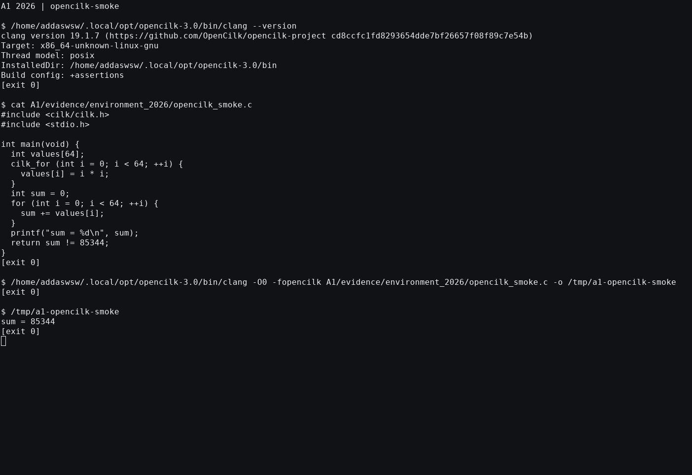

以下 CPU、内存、NUMA 和中断数据均来自 WSL guest。`perf` 软件事件可用，硬件 cycles/instructions 返回不支持。

## 2. 常用工具命令操作练习

### (1) uname -a

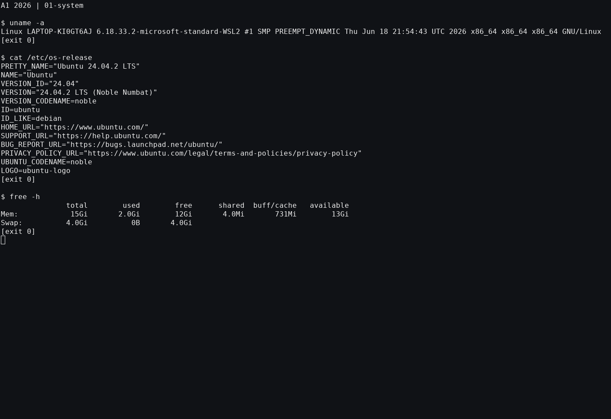

```bash
uname -a
```

**a. 输出信息。** 依次包含 kernel name、nodename、kernel release、kernel version、machine、processor、hardware platform 和 operating system。`Linux` 是内核名，主机名之后的 `6.18.33.2-microsoft-standard-WSL2` 是内核 release；`#1 SMP PREEMPT_DYNAMIC ...` 是构建版本信息，后三个 `x86_64` 分别对应机器、处理器及硬件平台，最后为 `GNU/Linux`。

**b. 内核与 ISA。** 本次 kernel release 为 `6.18.33.2-microsoft-standard-WSL2`，ISA 为 x86-64。

### (2) cat /etc/os-release

```bash
cat /etc/os-release
```

**a. 发行版字段。** `NAME` 为发行版名称 Ubuntu；`VERSION` 为包含代号的版本说明；`ID=ubuntu` 是程序识别用名称；`VERSION_ID=24.04` 是发行版版本号；`PRETTY_NAME` 是面向人的完整名称。`ID_LIKE=debian` 表示发行版家族，`VERSION_CODENAME` / `UBUNTU_CODENAME` 为 noble。各 URL 字段提供主页、支持、缺陷反馈及隐私说明，`LOGO` 指定标识名。它们描述用户空间发行版，不是 Linux kernel 版本。

### (3) sysctl -a

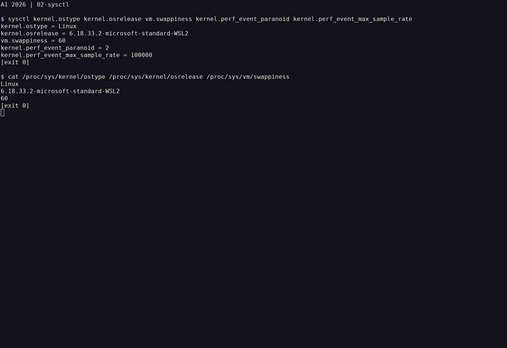

```bash
sysctl -a
sysctl kernel.ostype kernel.osrelease vm.swappiness
cat /proc/sys/kernel/ostype /proc/sys/kernel/osrelease /proc/sys/vm/swappiness
```

**a. 功能和 -a。** `sysctl` 读取或修改运行时内核参数；`-a` 列出可读取的参数。本次只读，不修改参数。

**b. 与 /proc/sys 的关系。** 点分名称映射到 `/proc/sys` 路径，例如 `vm.swappiness` 对应 `/proc/sys/vm/swappiness`。实际三组值均一致：

```text
kernel.ostype = Linux
kernel.osrelease = 6.18.33.2-microsoft-standard-WSL2
vm.swappiness = 60
```

**c. 与前两条命令比较。** `kernel.ostype` 与 `uname` 的 Linux 一致；`kernel.osrelease` 与 `uname -r` 一致。它们无需与 `/etc/os-release` 的 Ubuntu / 24.04 字面相同，因为前者是内核，后者是发行版。部分 sysctl 参数拒绝读取，原始错误已保留。

**d. 两个实际参数。** 从本次真实列表中选择以下两个参数，含义依据本机 `man 2 perf_event_open` 的配置文件部分：

| 参数 | 实测值 | 含义 |
|---|---:|---|
| kernel.perf_event_paranoid | 2 | 限制无特权性能监控；该级别将普通用户限制在用户态测量，不允许内核态测量。具有相应 capability 的进程另论 |
| kernel.perf_event_max_sample_rate | 100000 | 每秒允许的最大采样率；它是采样率上限，不是本次实际采样频率，过高可能增加系统负担 |

### (4) lscpu

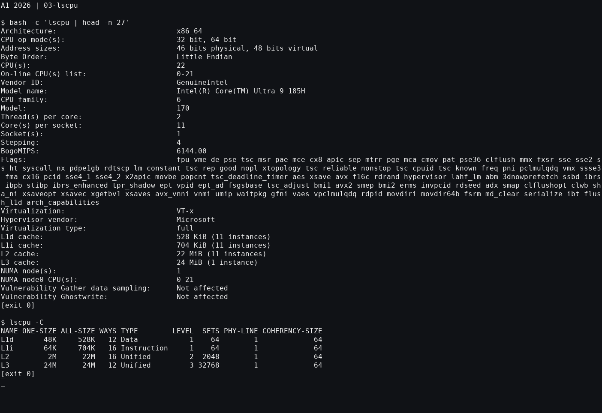

```bash
lscpu
lscpu -C
```

**a. 型号、核、线程、频率和缓存。**

| 项目 | 当前 guest 可见值 |
|---|---|
| 型号 | Intel(R) Core(TM) Ultra 9 185H |
| 架构 / 大小端 | x86_64 / Little Endian |
| Socket / 每 socket core / 每 core thread | 1 / 11 / 2 |
| 逻辑 CPU | 22，编号 0–21 |
| Address sizes | 46 bits physical，48 bits virtual |
| 基准 / 最大 / 最小频率 | 当前 guest 未暴露，无法由 lscpu 实测得到 |

由 guest 拓扑得到 11 个 core、每 core 2 个 hardware thread。该虚拟拓扑不能据此还原宿主 P/E core 布局或宿主物理核数。`cpufreq` 路径不存在；BogoMIPS 不是 CPU 频率，不能据其推算 base/min/max MHz。

| 缓存 | 每个实例容量（lscpu -C） | 实例数 | lscpu 汇总容量 |
|---|---:|---:|---:|
| L1d | 48 KiB | 11 | 528 KiB |
| L1i | 64 KiB | 11 | 704 KiB |
| L2 | 2 MiB | 11 | 22 MiB |
| L3 | 24 MiB | 1 | 24 MiB |

**b. 大小端与应用场景。** 小端序表示多字节对象的低有效字节放在低地址。大端应用场景是 TCP/IP 协议中多字节整数字段的 network byte order。

**c. Address sizes。** `physical` 表示处理器可寻址的物理地址宽度，`virtual` 表示有效虚拟（线性）地址宽度。64 位 ISA 和通用寄存器不要求实现全部 64 位地址；页表与地址转换硬件只实现其中一部分，x86-64 虚拟地址还需满足 canonical address 规则。本次分别为 46/48 位，不是 64/64；46 位也不意味着机器实际安装了 2^46 字节内存。

### (5) dmidecode

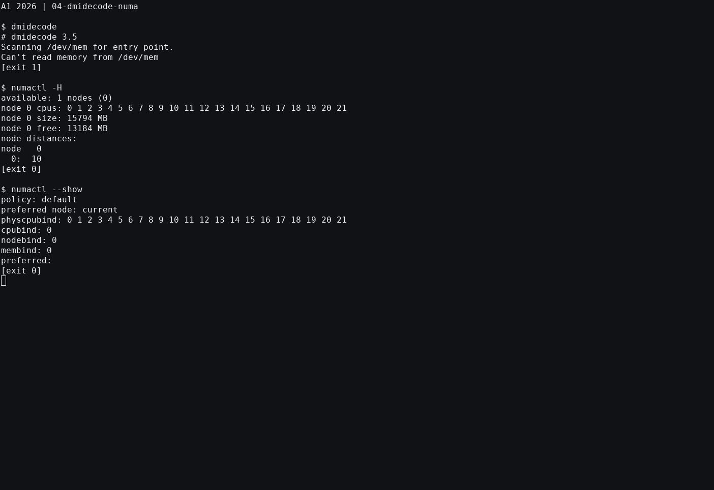

```bash
dmidecode
```

```text
# dmidecode 3.5
Scanning /dev/mem for entry point.
Can't read memory from /dev/mem
```

**a. 功能。** `dmidecode` 解码固件提供的 DMI/SMBIOS 表。

**b. 内存信息。** 正常内存条信息可含容量、插槽、类型、速度、制造商、序列号、位宽以及配置速度；这些是固件报告的数据，不保证一定准确。

本次未取得内存条信息：`/dev/mem` 和 `/sys/firmware/dmi/tables` 均不存在，因此不能由此回答宿主内存条型号、插槽或序列号。

### (6) numactl -H / --show

```bash
numactl -H
numactl --show
```

```text
available: 1 nodes (0)
node 0 cpus: 0 1 2 3 4 5 6 7 8 9 10 11 12 13 14 15 16 17 18 19 20 21
node 0 size: 15794 MB
node 0 free: 13184 MB
node distances:
node   0
  0:  10
```

**a. 功能与 -H。** `numactl` 可为程序设置 CPU/内存 NUMA 策略；`-H`（`--hardware`）显示可用节点、CPU、节点内存及距离。

**b. 节点数。** 本次仅有 1 个节点 node 0。

**c. 距离与应用。** `node distances` 是相对访问距离/成本，不是纳秒；本地距离为 10。本机仅有单节点，不能实测远端访问劣势。多 socket 数据库、大规模内存密集型程序和 HPC 中，线程与数据跨节点分布可能增加访问延迟、占用互连带宽，因此绑核与首次分配位置会影响性能。

```text
policy: default
preferred node: current
physcpubind: 0 1 2 3 4 5 6 7 8 9 10 11 12 13 14 15 16 17 18 19 20 21
cpubind: 0
nodebind: 0
membind: 0
preferred:
```

**d. --show 的作用、输出分析和区别。** `--show` 查询调用进程当前的 NUMA 策略与绑定：`policy: default` 为默认内存策略；`preferred node: current` 表示默认情况下优先当前执行位置的本地节点；`physcpubind: 0 ... 21` 是允许执行的逻辑 CPU；`cpubind: 0` 为这些 CPU 对应的 NUMA 节点；`nodebind: 0` 为节点绑定集合；`membind: 0` 为可用的内存节点集合；末尾 `preferred:` 为空，未列出额外优先节点。

`-H` 面向硬件拓扑，`--show` 面向当前进程的策略。

### (7) free -h

```bash
free -h
```

**a. 两行及各列含义。** `Mem` 为物理内存，`Swap` 为交换空间。`total` 为总量；`used` 为使用量（本版内存口径为 total − available）；`free` 为完全未使用量；`shared` 主要为 tmpfs 等共享内存；`buff/cache` 为缓冲区、页缓存和可回收 slab；`available` 是不发生 swapping 时仍可供新程序使用的估计量，包含可回收缓存，不等于 free。Swap 行只有 total、used、free，本次使用量 0B。

**b. 单位。** GiB = 2^30 = 1,073,741,824 bytes，GB = 10^9 = 1,000,000,000 bytes；1 GiB ≈ 1.074 GB。`-h` 自动缩放为人可读的二进制单位，本次表中 `15Gi` 等是舍入显示，不能当成精确字节数。

### (8) ps -aux

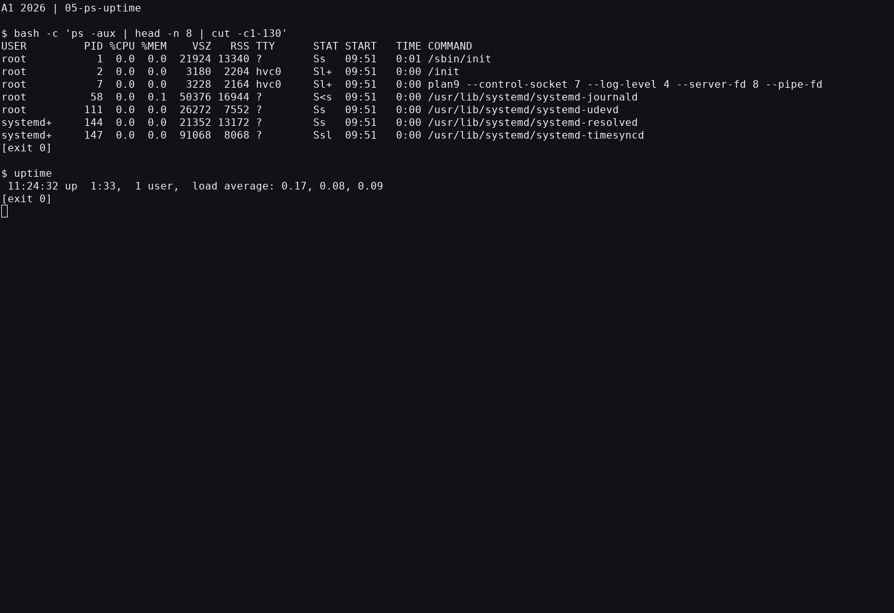

```bash
ps -aux
```

**a. 每列含义。** 实际表头：

```text
USER         PID %CPU %MEM    VSZ   RSS TTY      STAT START   TIME COMMAND
```

| 列 | 含义 |
|---|---|
| USER / PID | 有效用户 / 进程 ID |
| %CPU | 累计 CPU 时间与进程存活墙钟时间之比 |
| %MEM | RSS 与可见物理内存之比 |
| VSZ / RSS | 虚拟地址空间大小 / 当前驻留内存，通常以 KiB 计 |
| TTY | 控制终端，`?` 表示没有 |
| STAT | 进程状态及附加标记；如 R 运行、S 可中断睡眠、D 不可中断睡眠、Z 僵尸，s 为会话首进程、+ 为前台进程组 |
| START / TIME | 启动时间 / 累计 CPU 时间 |
| COMMAND | 命令及参数 |

`ps` 是一次快照。本机兼容 `ps -aux`；man 提醒其混用 BSD/UNIX 选项语法存在历史歧义，可移植写法通常用 `ps aux`。

### (9) top 与 htop

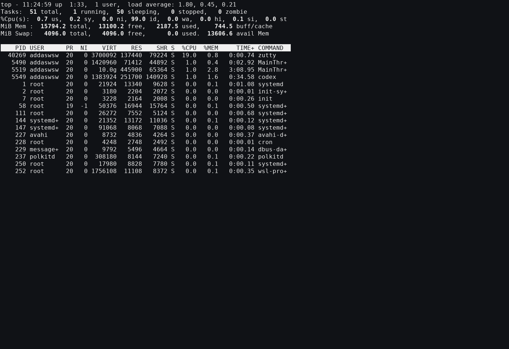

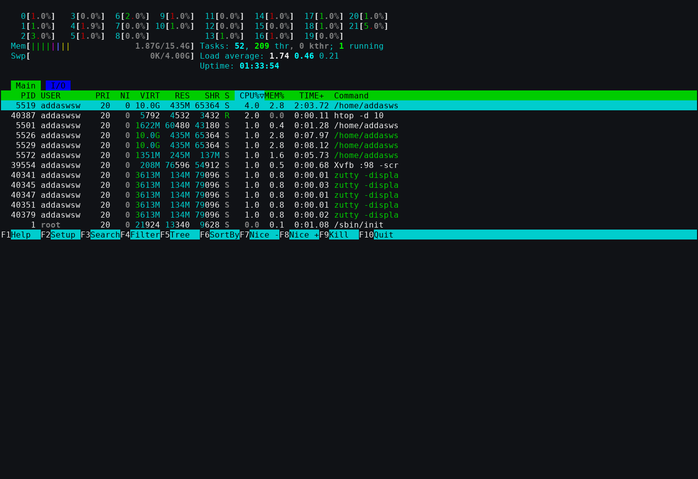

```bash
top
htop
```

两个工具均已运行并按 `q` 退出。

**a. top 各栏。** 摘要区依次为：当前时间、uptime、登录用户数、1/5/15 分钟 load average；Tasks 的 total/running/sleeping/stopped/zombie；CPU 时间 `us/sy/ni/id/wa/hi/si/st`（用户态、内核态、调整 nice 的用户态、空闲、I/O 等待、硬中断、软中断、虚拟化被窃取时间）；Mem/Swap 的 total/free/used/buff-cache/available。

实际进程列 `PID USER PR NI VIRT RES SHR S %CPU %MEM TIME+ COMMAND` 分别是进程 ID、用户、调度优先级、nice、虚拟内存、驻留内存、可共享驻留内存、状态、CPU 利用率、内存占比、累计 CPU 时间（到百分之一秒）和命令。

**b. top 与 htop 比较。** 相比 top，默认 htop 界面用多核 CPU/内存条形图表示负载，底栏提供 F3 搜索、F4 筛选、F5 树视图、F6 排序、F7/F8 nice 和 F9 信号操作。top 的文本摘要紧凑、常见于基本系统安装，也支持排序、信号和树状显示等交互；htop 通常需另装包。

### (10) vmstat 1

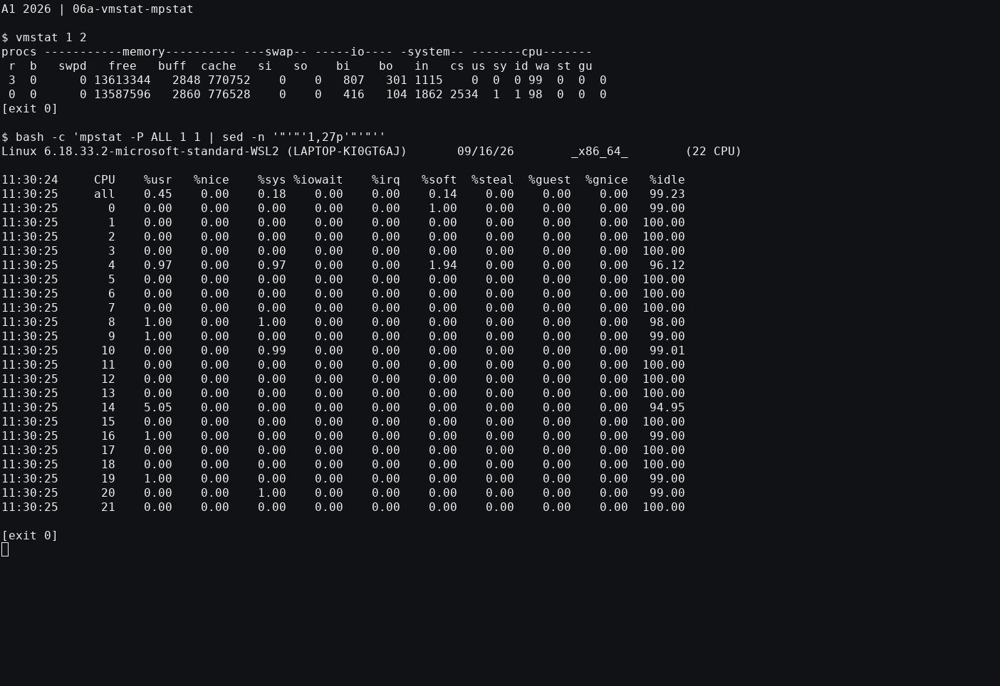

```bash
vmstat 1
```

已实际采样进程、内存、swap、I/O 和 CPU 信息，按 Ctrl+C 结束。

### (11) mpstat -P ALL 1

```bash
mpstat -P ALL 1
```

已实际采样全部逻辑 CPU 和总体 CPU 时间比例。

### (12) pidstat 1

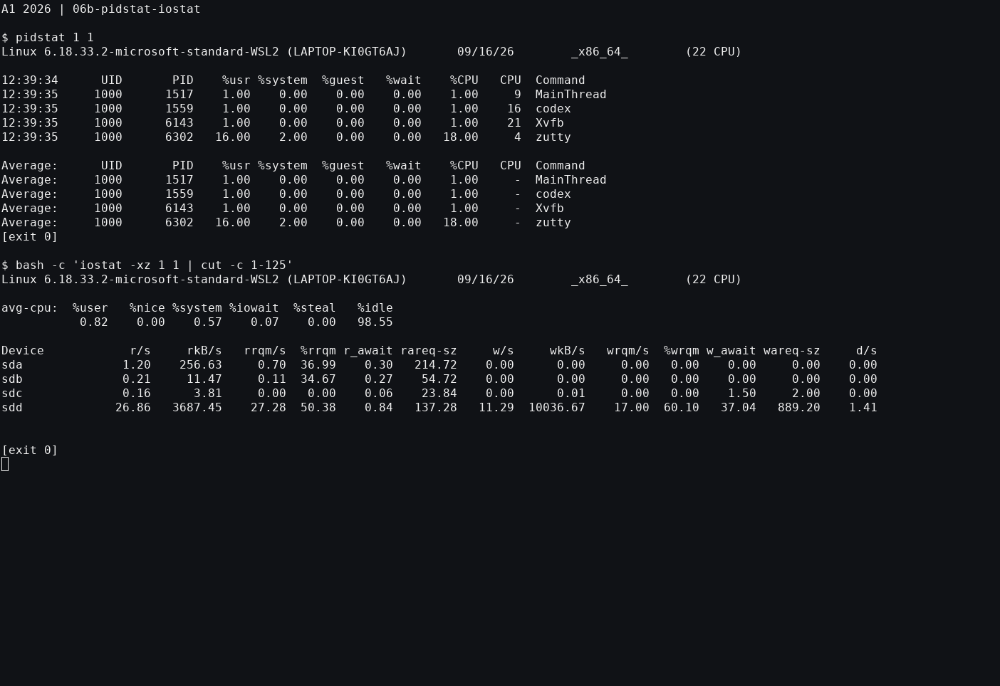

```bash
pidstat 1
```

已实际采样活动进程；空闲时不一定有进程记录，随后用短时负载进行 CPU 对比。

### (13) iostat -xz 1

```bash
iostat -xz 1
```

已实际采样块设备扩展统计。

**（10）—（13）共同问题 a、b：参数 1 与统计范围。**

各命令均采样约 4–5 秒后发送 Ctrl+C。

| 命令 | 参数与首份报告口径 | 主要统计对象 |
|---|---|---|
| vmstat 1 | 每 1 秒刷新；第一份速率信息主要是开机至今平均，后续为采样区间；进程、内存字段为瞬时状态 | r/b 任务、内存、swap in/out、block I/O、interrupt/context switch、CPU 时间；本版还有 gu（guest） |
| mpstat -P ALL 1 | 每 1 秒报告区间统计；ALL 显示每个 CPU 和总体 all；这里指定非零 interval，不按 interval=0 的开机以来口径解释 | 每 CPU 的用户态、内核态、nice、IRQ、softirq、I/O wait、steal、guest、idle 等比例 |
| pidstat 1 | 每 1 秒报告活动进程区间统计；未指定 PID 时默认筛选有活动的任务；interval=0 才是开机以来统计模式 | UID/PID、%usr、%system、%guest、%wait、%CPU、CPU 编号和命令 |
| iostat -xz 1 | 每 1 秒；默认第一份自开机以来，后续为区间；-x 扩展统计、-z 省略无活动设备 | CPU 摘要及块设备读写/丢弃/flush 速率、吞吐、合并、平均等待、队列长度及 %util |

`iostat %util` 是设备有请求活动的时间比例，不可直接等同于现代并行存储设备的带宽饱和度。`pidstat %wait` 是任务等待运行的比例，不等于 `%CPU`，也不是系统 `%iowait`。

**c. CPU utilization 的区别。** 为观察不同统计窗口，启动一个先 sleep 3 秒、再单线程忙循环 8 秒的 Python 进程（本次 namespace 内 PID 4），同时采样并在结束后确认进程已退出：

| 工具 | 实际观察 | 解释 |
|---|---|---|
| ps（选取 PID，%CPU 与 aux 同一字段） | 进程年龄约 3/5/7/9 秒时为 14.0/45.3/59.9/68.3% | 包含前 3 秒睡眠的生命周期平均值，因此逐步上升 |
| pidstat -p 4 1 6 | 六个区间均为 100.00% | 每个 1 秒采样区间中该线程持续占用一个 CPU |
| top -d 1 -p 4 | 刷新记录中为 100.0% | 相邻刷新间 CPU 时间增量；首帧与后续帧初始化窗口可能不同 |
| htop -d 10 -p 4 | 刷新界面显示该进程 99.9% | -d 的 10 表示 10 个十分之一秒，即 1 秒刷新；CPU% 基于采样增量 |

各工具的采样时刻略有差异。top 默认 Irix 模式、pidstat 未用 `-I` 时以单逻辑 CPU 为 100%，多线程进程可能超过 100%；top Solaris 模式或 pidstat `-I` 会按 CPU 数归一化。htop 的普通 CPU% 也以单 CPU 为基准，不能与系统所有 CPU 平均占比直接比较。22 CPU 上一个满载线程只约占总计算容量的 1/22。

### (14) sar -n DEV 1

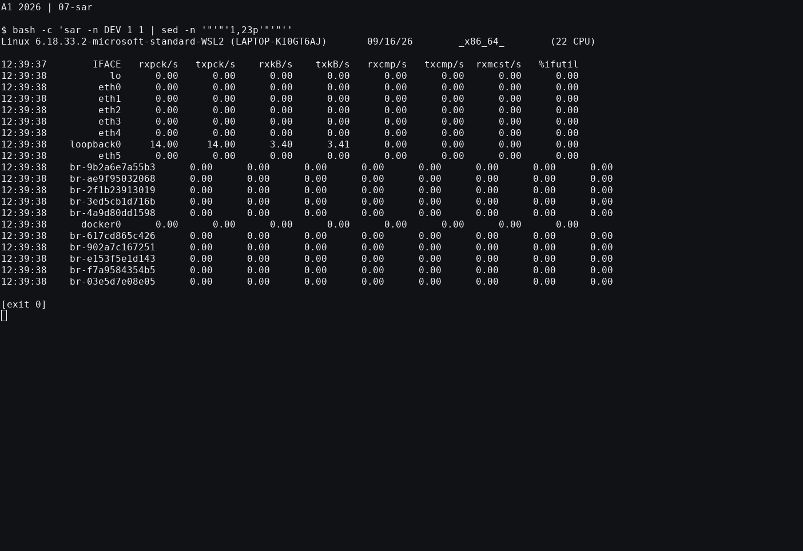

```bash
sar -n DEV 1
```

**a.** `1` 为连续采样间隔 1 秒。

**b.** `-n DEV` 查看网络接口统计。实际表头包含 IFACE、rxpck/s、txpck/s、rxkB/s、txkB/s、rxcmp/s、txcmp/s、rxmcst/s、%ifutil。分别表示接口、每秒收/发包、每秒收/发 KiB、每秒收/发压缩包、每秒接收组播包和接口利用率（依赖可获得的链路速率与双工信息）。虚拟接口的 0.00 不能脱离该信息解释为真实物理链路负载为零。

### (15) uptime

```bash
uptime
```

```text
11:24:32 up  1:33,  1 user,  load average: 0.17, 0.08, 0.09
```

**a. 输出信息。** 显示截图时的时间 11:24:32、已运行 1 小时 33 分钟、1 个登录用户，以及 1/5/15 分钟 load average 0.17/0.08/0.09。

**b. load average。** Linux load 包含 runnable（运行或等待 CPU）和 uninterruptible tasks（如部分 I/O 等待），是平滑后的任务数量，不是 CPU 使用率；22 个逻辑 CPU 的负载解释也不能照搬单核系统。

### (16) /proc/interrupts 和 /proc/softirqs

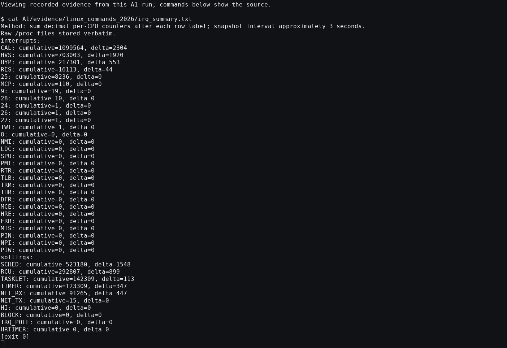

```bash
cat /proc/interrupts
cat /proc/softirqs
```

**a. 输出信息。** 两者列出每 CPU 的累计计数。`interrupts` 包含设备 IRQ 号、控制器/触发类型、设备名，也包含 CAL/RES 等核间中断及 Hyper-V 项；`softirqs` 按软中断类别（SCHED、RCU、TIMER、NET_RX 等）分类。它们是计数，不是处理时间。

**b. 最频繁的中断。** 将每行各 CPU 的计数求和，并取约 3 秒的两次快照：

| 类别 | 第二次快照累计 | 约 3 秒增量 | 解释 |
|---|---:|---:|---|
| interrupts 的 CAL | 1,099,564 | 2,304 | 所有中断行中累计和本窗口增量最高，为 Function call interrupts，涉及 CPU 间函数调用 |
| interrupts 的 HVS | 703,003 | 1,920 | Hyper-V stimer0 中断，体现 guest 虚拟定时器活动 |
| 数字设备 IRQ 25 | 8,236 | 0 | 数字设备 IRQ 中累计最高，标签 virtio0-virtqueues；本窗口设备 IRQ 没有增长 |
| softirqs 的 SCHED | 523,180 | 1,548 | 软中断中累计和本窗口增量最高，说明本窗口调度相关软中断活动较多 |
| softirqs 的 RCU | 292,807 | 899 | RCU 相关延迟处理活动 |

当前 WSL guest 可见的中断条目中，CAL 的累计和窗口增量最高，它属于核间函数调用中断。若只比较数字设备 IRQ，累计最高为 IRQ 25，但本窗口没有增长。宿主真实物理设备的 IRQ 分布仍无法从这里获得。

### (17) lstopo

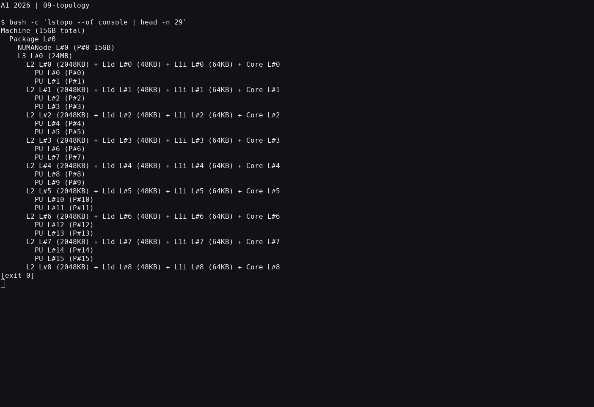

```bash
lstopo --of svg > A1/images/topo.svg
lstopo --of console
```

使用 hwloc 2.10.0 生成的拓扑如下：

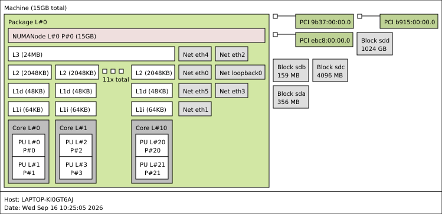

图中 Machine 约 15GB（工具自身标签，容量经过缩放），一个 Package、一个 NUMA node 0、共享的 24MB L3，以及 11 个 Core，每个 Core 下 2 个 PU（逻辑处理器），共 22 个 PU。图用省略符与“11x total”合并显示重复组，console 输出列出全部组。每组有 2MB L2、48KB L1d、64KB L1i；与 `lscpu -C` 的实例容量一致。还显示虚拟网络接口、PCI/HostBridge 和 sda–sdd 块设备节点；它们是 guest 可见的 I/O 对象，不直接等于物理设备清单。

### (18) Git 命令

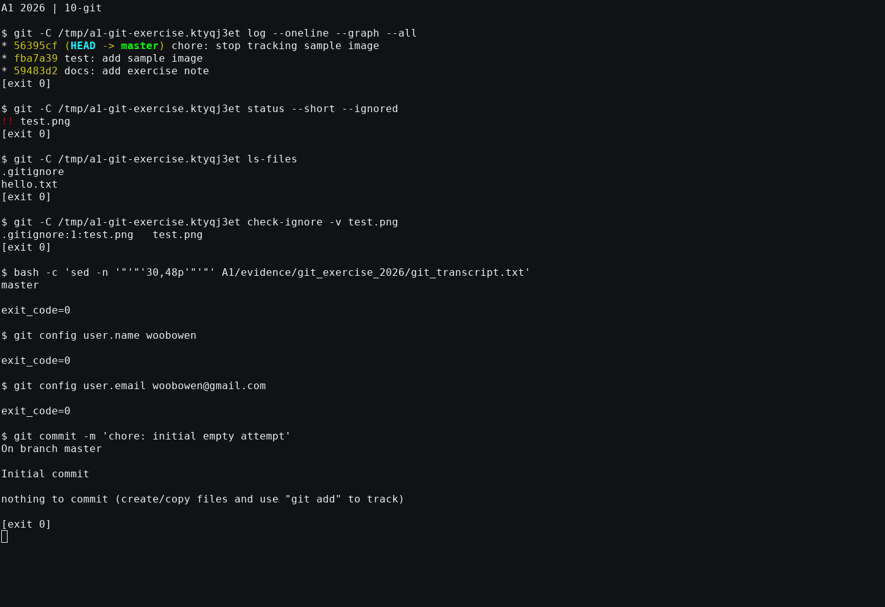

以下命令在独立的 Git 练习仓库中执行；该仓库没有 remote。

**1. 用户名和邮件。** 先读取现有全局 identity，然后仅设置本实验仓库：

```bash
git config --global --get user.name
git config --global --get user.email
git init
git config user.name woobowen
git config user.email woobowen@gmail.com
```

不带 `--global` 时默认写入当前仓库配置；`--global` 则影响当前用户各仓库。本实验未更改全局设置。

**2. 初始化与分支。** 本次 `git init` 后 `git symbolic-ref --short HEAD` 实测为 `master`。设置以后新仓库默认分支的命令是 `git config --global init.defaultBranch main`；修改当前仓库名称是 `git branch -m main`。

**3. 首次 commit。** 空暂存区执行：

```bash
git commit -m 'chore: initial empty attempt'
```

返回 `nothing to commit (create/copy files and use "git add" to track)`，exit 1。普通提交需要先有已暂存内容：

```bash
printf 'A1 Git exercise\n' > hello.txt
git add hello.txt
git commit -m 'docs: add exercise note'
```

实际成功生成 root commit `59483d2`。

**4. 图片、ignore 和取消跟踪。** 创建一张 1×1 测试 PNG 后：

```bash
git add test.png
git commit -m 'test: add sample image'
printf 'test.png\n' > .gitignore
git ls-files test.png
git rm --cached test.png
git add .gitignore
git commit -m 'chore: stop tracking sample image'
git status --short --ignored
git ls-files
git check-ignore -v test.png
```

仅添加 `.gitignore` 时 `git ls-files test.png` 仍显示该图片，因为 ignore 不影响已跟踪文件。`rm --cached` 取消索引跟踪而保留工作区文件；最终 `status` 显示 `!! test.png`，`ls-files` 只有 `.gitignore` 与 `hello.txt`，图片仍存在。取消跟踪也不会删除先前提交内的图片。

**5. Conventional Commits。** 结构是 `type(scope): description`，scope 可省略；body/footer 可补充细节。`feat` 表示功能，`fix` 表示缺陷修复；`!` 或 `BREAKING CHANGE:` footer 标明不兼容改变。它使历史表达修改意图，也方便生成变更记录。

**6. merge 与 rebase。** 分叉历史用 merge 合并时通常增加一个有两个父节点的 merge commit，保留原有提交关系；可以 fast-forward 时则只移动分支指针。rebase 把一组提交的改动重放到新基点，通常生成新的 commit ID，历史更线性。merge 适合保留协作分支的合并关系；rebase 适合整理尚未共享的本地提交。对已共享历史 rebase 会让他人已有提交关系失效，需谨慎协调。

## 3. MIT 6.172 Homework 1

使用老师提供的 starter code 完成以下 Write-up。

### Write-up 2

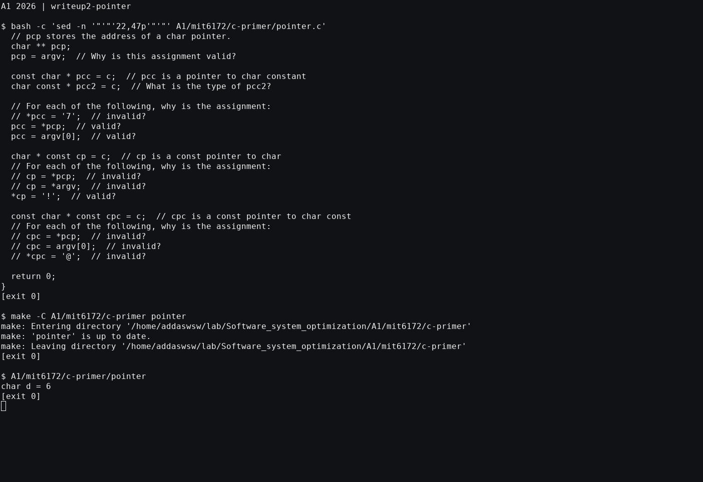

原始 `make pointer` 实际报出六条 const 赋值错误。注释非法语句后编译、运行，输出 `char d = 6`。[代码](mit6172/c-primer/pointer.c)。

`argv` 在函数形参中由 `char *argv[]` 调整为 `char **`。`&i` 取 i 的地址，`*pi` 解引用取得 5，所以 j 为 5。数组 c 在赋给 pc 时退化成指向 c[0] 的指针，`*pc` 是字符 `'6'`，不是数值 6。`pcp = argv` 两端都是 `char **`。

| 声明/语句 | 是否合法及原因 |
|---|---|
| const char *pcc / char const *pcc2 | 同一种类型：指向只读 char 的可修改指针；限制通过该指针修改对象，不表示 c 本身成为 const |
| *pcc = '7' | 非法，通过 pcc 得到的 char 不可修改 |
| pcc = *pcp / pcc = argv[0] | 合法，指针自身可变；char * 可赋给 const char *，增加所指对象的 const 限定 |
| char *const cp = c | 指针自身 const，所指 char 可变 |
| cp = *pcp / cp = *argv | 非法，重赋值 const 指针 |
| *cp = '!' | 合法，c 是可写字符数组；该句发生在输出 d 之后，不改变已输出的字符 |
| const char *const cpc = c | 指针自身和经其访问的 char 均不可修改 |
| cpc = *pcp / cpc = argv[0] | 非法，修改指针自身 |
| *cpc = '@' | 非法，通过 cpc 修改只读 char |

### Write-up 3

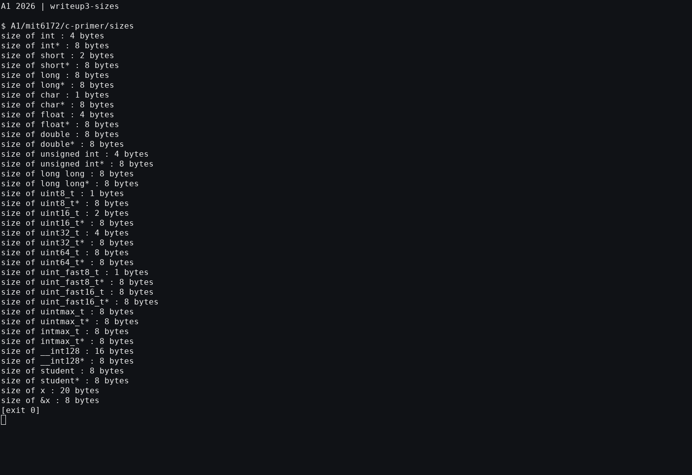

使用简单 `PRINT_SIZE` 宏输出各类型及其指针大小，数组 x 和结构体 you 分别通过 `&x`、`&you` 取得地址。[sizes.c](mit6172/c-primer/sizes.c)。

```bash
make sizes
./sizes
```

这些是本机 x86-64 ABI 下的实测字节数，不是所有平台的保证。x 为 5 个 int，大小 20；`&x` 是指向整个数组的指针，大小 8，不是数组本身大小。student 的两个 int 在本机共 8 字节。

### Write-up 4

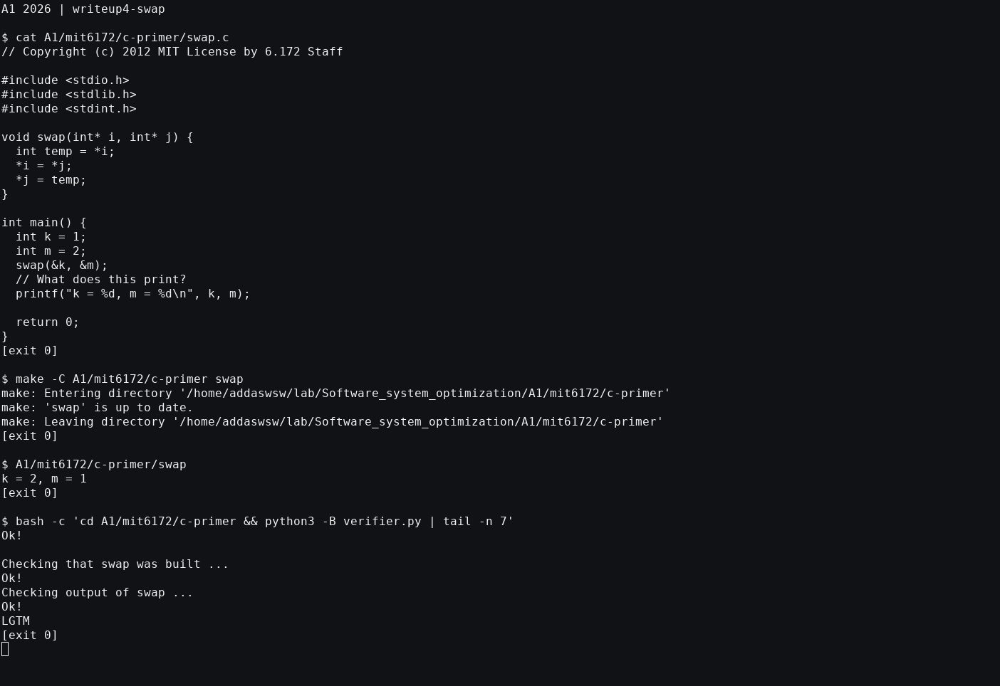

按值传参 baseline 输出 `k = 1, m = 2`，因为交换的只是形参副本。改用指针并传入地址后：

```c
// Copyright (c) 2012 MIT License by 6.172 Staff

#include <stdio.h>
#include <stdlib.h>
#include <stdint.h>

void swap(int* i, int* j) {
  int temp = *i;
  *i = *j;
  *j = temp;
}

int main() {
  int k = 1;
  int m = 2;
  swap(&k, &m);
  // What does this print?
  printf("k = %d, m = %d\n", k, m);

  return 0;
}
```

```bash
make swap
./swap
python3 verifier.py
```

实际交换输出为 `k = 2, m = 1`，verifier 最终输出 `LGTM`。老师脚本为 Python 2 语法，本机无 Python 2；仅转换 print、字符串参数判断与 subprocess 文本输出，expected values 和检查规则保持不变。

### Write-up 5

构建图对应修复后的代码；GDB 图展示初始维度错误。

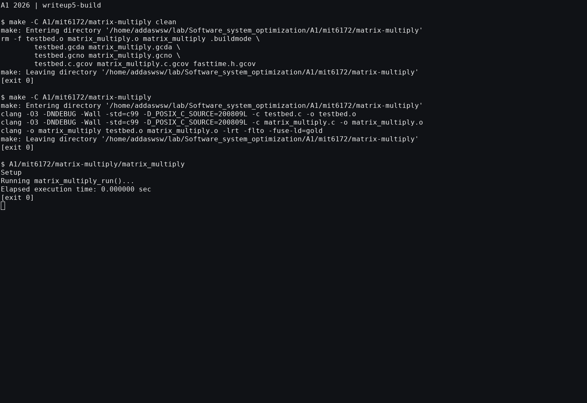

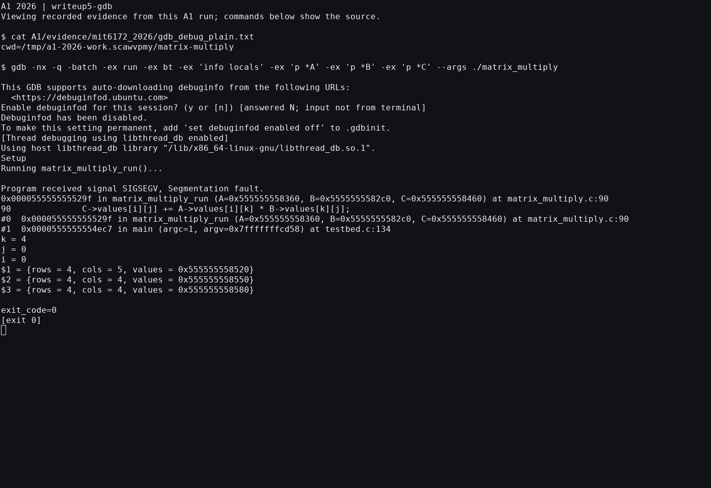

按题目将 `CFLAGS_RELEASE` 从 `-O1 -DNDEBUG` 改为 `-O3 -DNDEBUG`。实际 `make clean` / `make` 输出：

```text
rm -f testbed.o matrix_multiply.o matrix_multiply .buildmode \
        testbed.gcda matrix_multiply.gcda \
        testbed.gcno matrix_multiply.gcno \
        testbed.c.gcov matrix_multiply.c.gcov fasttime.h.gcov
clang -O3 -DNDEBUG -Wall -std=c99 -D_POSIX_C_SOURCE=200809L -c testbed.c -o testbed.o
clang -O3 -DNDEBUG -Wall -std=c99 -D_POSIX_C_SOURCE=200809L -c matrix_multiply.c -o matrix_multiply.o
clang -o matrix_multiply testbed.o matrix_multiply.o -lrt -flto -fuse-ld=gold
```

两个 C 文件分别编译为 `.o`，再链接为 `matrix_multiply`；本机使用系统 Clang 18.1.3。修改优化级别后运行原程序，仍收到 SIGSEGV。

debug 构建中定位到原 `matrix_multiply.c:90`，`i=0,j=0,k=4`，A 为 4×5、B 为 4×4、C 为 4×4。开启断言后明确报告 `A->cols = 5, B->rows = 4`。将 A 也修成 4×4 后不再发生该越界崩溃。

### Write-up 6

下图为维度修正后、尚未释放矩阵时保存的 ASan 输出。

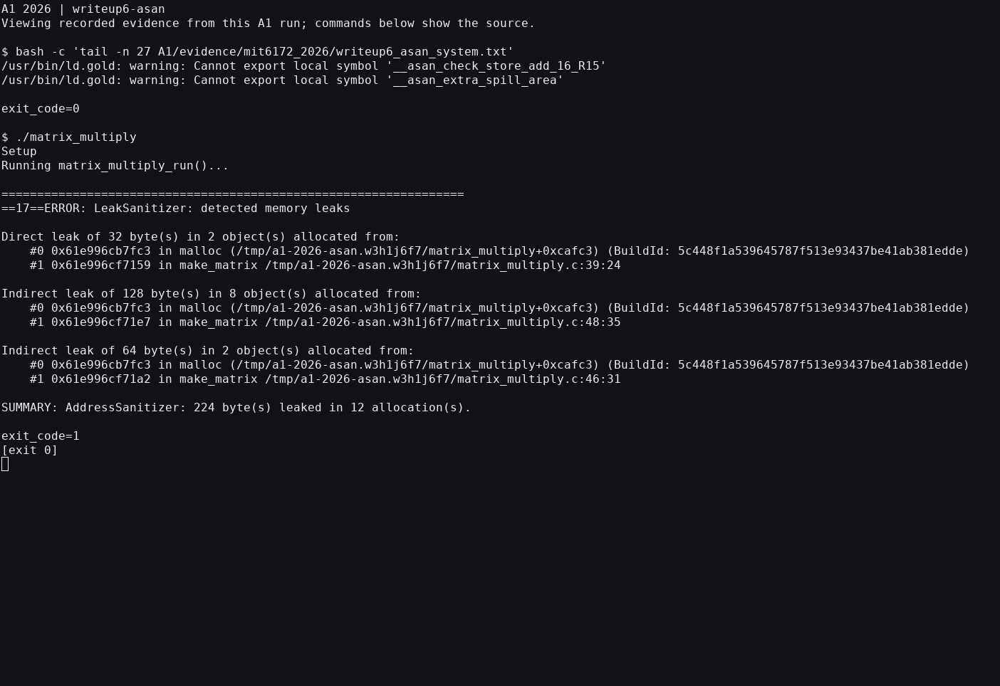

在修正维度、尚未初始化及释放矩阵的阶段，使用系统 Clang 18 runtime 执行：

```bash
make clean
make ASAN=1
./matrix_multiply
```

LeakSanitizer 报告如下，退出码为 1：

```text
ERROR: LeakSanitizer: detected memory leaks
Direct leak of 32 byte(s) in 2 object(s)
Indirect leak of 128 byte(s) in 8 object(s)
Indirect leak of 64 byte(s) in 2 object(s)
SUMMARY: AddressSanitizer: 224 byte(s) leaked in 12 allocation(s).
```

本次栈已解析到 `make_matrix` 的结构体、行指针数组和行数据分配。ASan 没有报告未初始化数值，该问题由随后 Valgrind 定位。

### Write-up 7

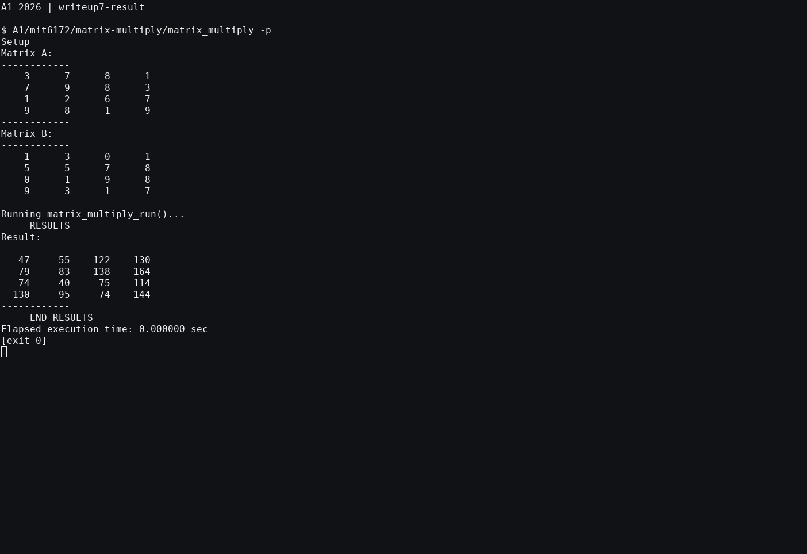

维度修复后，Valgrind 仍报告 `Use of uninitialised value` 和条件分支依赖未初始化值。`--track-origins=yes` 将来源定位到 `make_matrix` 中的行缓冲 malloc；乘法使用 `C->values[i][j] += ...`，首次累加前 C 尚未置零。将行分配改为 `calloc(cols, sizeof(int))`，保留原结构与三重循环。

```bash
make
./matrix_multiply -p
```

例如 C[0][0] = 3×1 + 7×5 + 8×0 + 1×9 = 47。最终还用独立脚本从打印的 A/B 重算全部 16 个结果，并检查 `-pz` 的 A/B/C 全零。

### Write-up 8

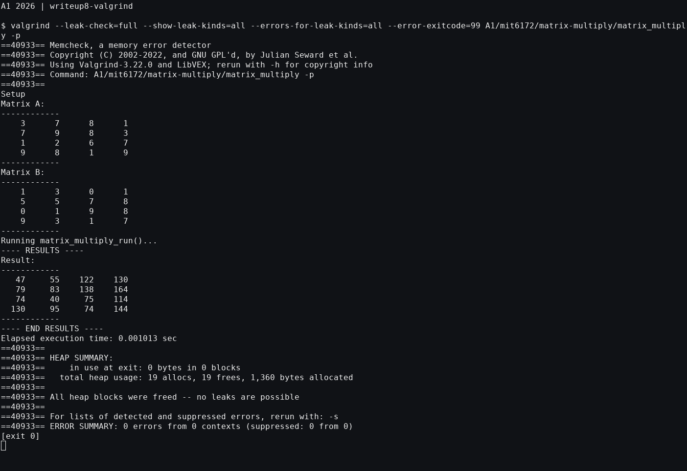

只修复初始化时，Valgrind 仍显示 definitely lost 48 bytes / 3 blocks、indirectly lost 288 bytes / 15 blocks。程序结束前对 A/B/C 调用 `free_matrix`；它逐行释放，再释放行指针数组及结构体。严格检查命令：

```bash
valgrind --leak-check=full --show-leak-kinds=all \
  --errors-for-leak-kinds=all --error-exitcode=99 ./matrix_multiply -p
```

本轮修复后关键输出：

```text
HEAP SUMMARY:
==40933==     in use at exit: 0 bytes in 0 blocks
==40933==   total heap usage: 19 allocs, 19 frees, 1,360 bytes allocated
==40933==
==40933== All heap blocks were freed -- no leaks are possible
==40933==
==40933== For lists of detected and suppressed errors, rerun with: -s
==40933== ERROR SUMMARY: 0 errors from 0 contexts (suppressed: 0 from 0)
```

该命令 exit 0。
