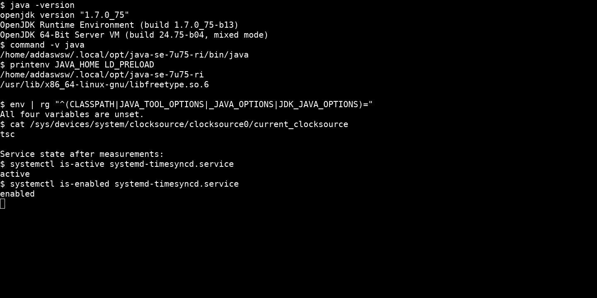
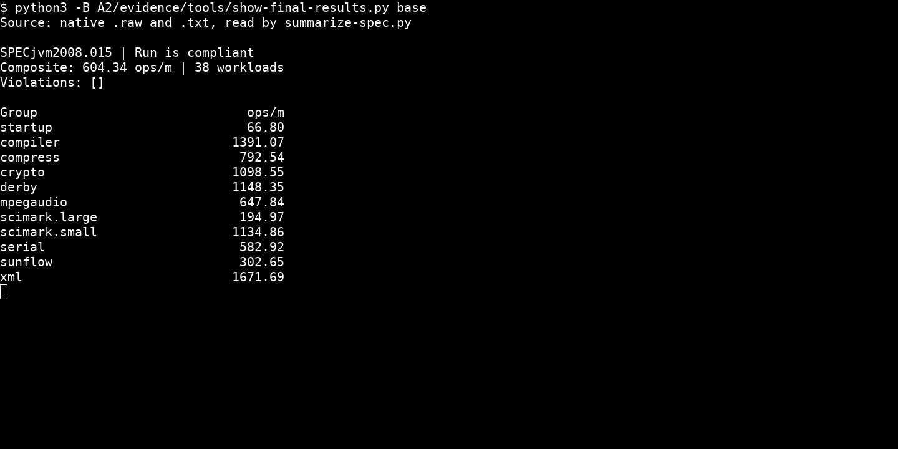
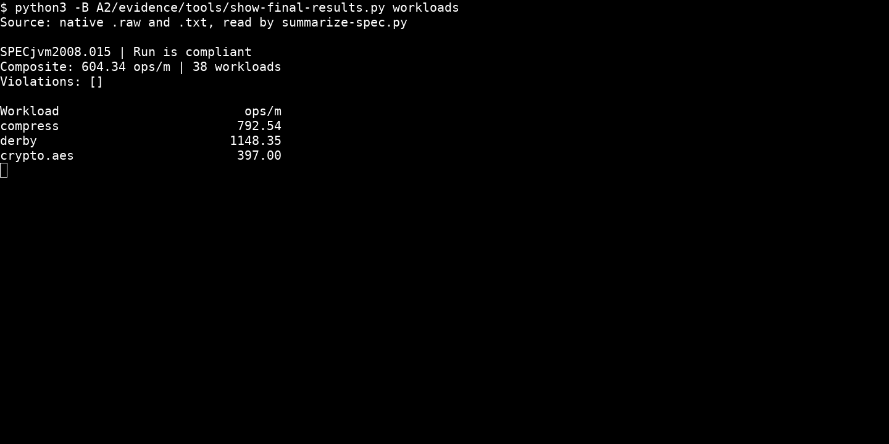
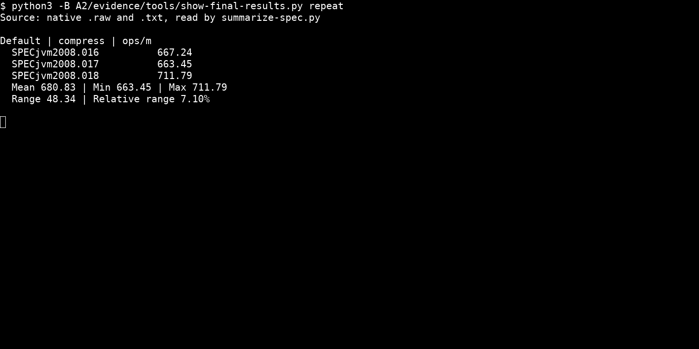
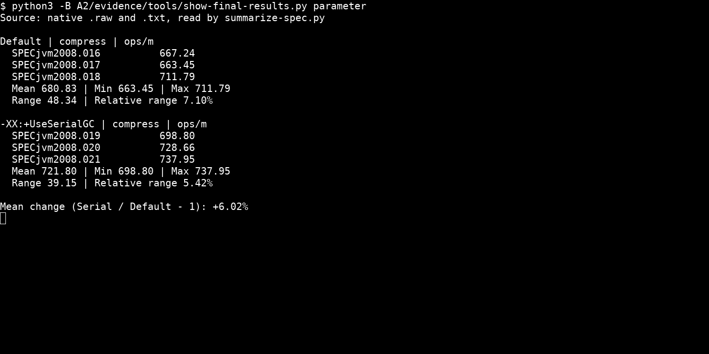

# 上机作业 A2：SPECjvm2008 基准评测

学号：10245102410

姓名：吴博闻

## 系统信息

| 系统信息 | 配置 |
|---|---|
| 操作系统 | Ubuntu 24.04.2 LTS，WSL2；Linux 6.18.33.2-microsoft-standard-WSL2，x86_64 |
| CPU | Intel Core Ultra 9 185H；WSL2 中可用 22 个逻辑处理器 |
| 内存 | WSL2 中显示 15.42 GiB；Swap 4 GiB |

## 1. SPECjvm2008 的用途与测试类别

SPEC（Standard Performance Evaluation Corporation）制定标准化性能基准。SPECjvm2008 衡量 Java 运行环境执行单个应用时的性能，也反映 CPU、内存和操作系统的影响；它对文件 I/O 的依赖较低，不包含跨机器网络 I/O。成绩以每分钟完成的操作数（ops/m）表示。[官网](https://www.spec.org/jvm2008/)、[FAQ](https://www.spec.org/jvm2008/docs/FAQ.html)

| Workload | 主要工作与特点 |
|---|---|
| compiler | 用套件自带的 javac 编译编译器自身和 Sunflow 源码，尽量减少文件 I/O 的影响 |
| compress | 对真实文件数据进行 LZW 压缩和解压，包含字符串查找和位操作 |
| crypto | 对称加解密、RSA 加解密及签名验证，使用 JRE 的加密实现 |
| derby | Java 数据库与 BigDecimal 运算，涉及数据库逻辑、锁和高精度计算 |
| mpegaudio | 用 JLayer 解码 MP3，浮点运算较多 |
| scimark | FFT、LU、SOR、稀疏矩阵和 Monte Carlo；大小数据集分别考察内存访问与计算表现 |
| serial | 对象序列化和反序列化，通过同机 socket 连接生产者与消费者 |
| startup | 新建 JVM 并完成一次工作负载，衡量 JVM 与应用的启动开销 |
| sunflow | 多线程全局光照渲染，每个渲染实例内部使用多个线程 |
| xml | XML 样式转换与模式校验，使用 JRE 提供的 XML API |

各项的具体定义见[官方 workload 说明](https://www.spec.org/jvm2008/docs/benchmarks/index.html)。

Base 各项采用统一的默认 JVM 配置，不允许手工调优 JVM 或更改默认运行时间；Peak 允许按测试项调优 JVM，并可延长运行时间。[User's Guide](https://www.spec.org/jvm2008/docs/UserGuide.html)、[Run and Reporting Rules](https://www.spec.org/jvm2008/docs/RunRules.html)

## 2. 安装、环境配置与完整 Base

SPECjvm2008 1.01（20090519）从[官方网站](https://www.spec.org/jvm2008/)下载，使用 JDK 8 运行安装器的 `-i console` 模式，安装到 `~/.local/opt/specjvm2008/`。实验选用[官方 OpenJDK 7u75 RI](https://jdk.java.net/java-se-ri/7)，位于 `~/.local/opt/java-se-7u75-ri/`。Java 21 的功能检查出现模块访问错误，JDK 8 的 compiler 启动测试也遇到兼容问题；相关限制见 [FAQ Q4.8](https://www.spec.org/jvm2008/docs/FAQ.html#Q4.8)和 [Known Issues](https://www.spec.org/jvm2008/docs/KnownIssues.html)。

`JAVA_HOME` 指向该 JDK，`PATH` 将其 `bin` 放在首位；`CLASSPATH`、`JAVA_TOOL_OPTIONS`、`_JAVA_OPTIONS` 和 `JDK_JAVA_OPTIONS` 均不设置。JDK 7 自带 FreeType 与系统 fontconfig 不兼容，运行时通过 `LD_PRELOAD` 使用系统库，使报告图像正常生成。



```bash
export JAVA_HOME="$HOME/.local/opt/java-se-7u75-ri"
export PATH="$JAVA_HOME/bin:$PATH"
export LC_ALL=C.UTF-8
export LD_PRELOAD=/usr/lib/x86_64-linux-gnu/libfreetype.so.6
unset CLASSPATH JAVA_TOOL_OPTIONS _JAVA_OPTIONS JDK_JAVA_OPTIONS
cd "$HOME/.local/opt/specjvm2008"
java -jar SPECjvm2008.jar --base
```

Base 使用默认 JVM 配置，properties 未修改。普通吞吐项目预热 120 秒、测量 240 秒。



Base 总体成绩为 **604.34 ops/m**，包含 38 个计分 workload。完整原生结果保存在 [results/base/SPECjvm2008.015/](results/base/SPECjvm2008.015/)，包含 raw、TXT、HTML、summary、sub 和报告图片。

WSL2 前期出现过离散时间校正，因此这次测量使用 `tsc`，暂时停止 `systemd-timesyncd`，并以 Windows 主机计时对照 Linux 单调时钟。全部测量结束后已恢复服务。

## 3. 总体结果与测试项分析

总体成绩为 **604.34 ops/m**。从同一次完整 Base 中选取三个具体测试项：



| Workload | 成绩（ops/m） |
|---|---:|
| compress | 792.54 |
| derby | 1148.35 |
| crypto.aes | 397.00 |

这三项中 derby 的 ops/m 最高，crypto.aes 最低。compress 主要进行 LZW 压缩、解压和数组访问；derby 结合数据库逻辑、锁与 BigDecimal 运算；crypto.aes 使用 JRE 的 AES、DES 实现，运算路径和每次操作的数据量不同。这些差异会影响每分钟完成的操作数，不能将不同 workload 的分数比直接解释为加速比。[compress](https://www.spec.org/jvm2008/docs/benchmarks/compress.html)、[derby](https://www.spec.org/jvm2008/docs/benchmarks/derby.html)、[crypto](https://www.spec.org/jvm2008/docs/benchmarks/crypto.html)

## 4. 与官方结果比较

选用 Sugon I620-G20 的记录 `jvm2008-20150120-00018`，Base 成绩为 **853.15 ops/m**。[Summary Report](https://www.spec.org/jvm2008/results/res2015q1/jvm2008-20150120-00018.html)、[Base Report](https://www.spec.org/jvm2008/results/res2015q1/jvm2008-20150120-00018.base/SPECjvm2008.base.html)


| 配置 | 官方记录 | 本机 |
|---|---|---|
| 操作系统 | Red Hat Enterprise Linux 6.5，64 位 | Ubuntu 24.04.2 LTS / WSL2 |
| CPU | 2 × Xeon E5-2660 v3，20 核、40 逻辑处理器，2.60 GHz | Core Ultra 9 185H，WSL2 中 22 个逻辑处理器 |
| 内存 | 256 GB，16 × 16 GB DDR4-2133 | WSL2 中 15.42 GiB |
| JDK/JVM | Red Hat OpenJDK 1.7.0_45，64-Bit Server VM 24.45-b08 | OpenJDK 1.7.0_75 RI，64-Bit Server VM 24.75-b04 |
| Base 总体结果 | 853.15 ops/m | 604.34 ops/m |

本机总体成绩低于这条官方记录。官方机器使用双路服务器处理器、更多逻辑处理器和更大内存，本机则在 WSL2 中运行；两者的操作系统和 JVM 版本也不同。这些软硬件差异会共同影响结果，不能把差距全部归因于某一项配置。

## 5. 单项三次独立运行

选择 compress，保持 JDK 和环境变量一致，使用 22 个线程、120 秒预热和 240 秒测量。每次新建 JVM，两次之间间隔约 1 分钟：

```bash
java -jar SPECjvm2008.jar compress
```

三次完整结果见 [results/repeat/](results/repeat/)。



| 次数 | compress（ops/m） |
|---|---:|
| 1 | 667.24 |
| 2 | 663.45 |
| 3 | 711.79 |
| 均值 | **680.83** |
| 最小值～最大值 | 663.45～711.79 |
| 极差 | 48.34 |
| 相对极差 | 7.10% |

相对极差为“极差 / 均值 × 100%”。JIT 编译、垃圾回收、操作系统调度和缓存状态都可能造成运行间差异，WSL2 还与宿主共享资源，因此需要结合多次结果比较性能。

## 6. 运行体会与问题处理

套件较旧，需要先检查 JDK 兼容性。JDK 8 的 startup.compiler.sunflow 因套件未读取子进程的大量 stderr 而阻塞，改用 Java 7 后启动测试正常；报告字体库冲突则通过预加载系统 FreeType 解决。字体故障时 Java 进程仍返回 0，因此还需要检查原生报告和图片。

时钟问题也说明，计算结果正确不代表性能计时可靠。比较 JVM 参数时，既要看多次运行的均值，也要看波动范围，不能仅凭一次分数升高就判断优化有效。

## 7. 修改一个 JVM 参数

选择 **`-XX:+UseSerialGC`**，比较默认收集器与 Serial GC，其他实验条件保持一致：

```bash
java -XX:+UseSerialGC -jar SPECjvm2008.jar compress
```

三次完整结果见 [results/parameter/](results/parameter/)。



| 次数 / 统计 | 默认配置（ops/m） | Serial GC（ops/m） |
|---|---:|---:|
| 1 | 667.24 | 698.80 |
| 2 | 663.45 | 728.66 |
| 3 | 711.79 | 737.95 |
| 均值 | **680.83** | **721.80** |
| 最小值～最大值 | 663.45～711.79 | 698.80～737.95 |
| 极差 | 48.34 | 39.15 |
| 相对极差 | 7.10% | 5.42% |

均值变化按“（Serial 均值 / 默认均值 − 1）× 100%”计算，为 **+6.02%**。两组区间重叠，且变化幅度与运行间波动接近，三次测量不足以确认稳定提升。

Serial GC 改变垃圾回收的并行程度和线程协调开销，可能影响创建对象和数组的 compress 工作负载。[Java 7 GC Ergonomics](https://docs.oracle.com/javase/7/docs/technotes/guides/vm/gc-ergonomics.html)
