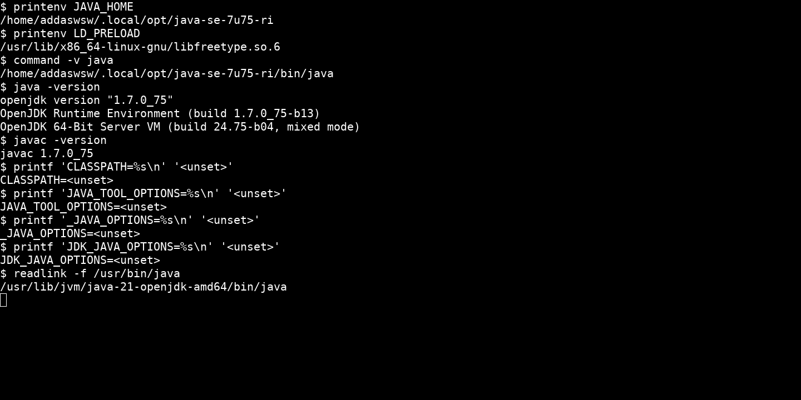
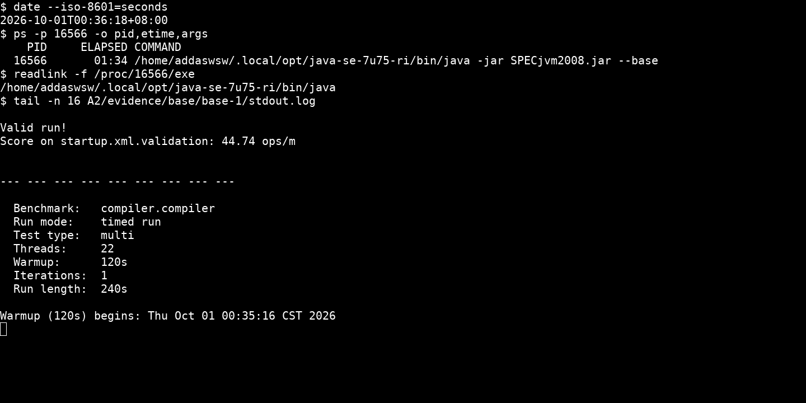
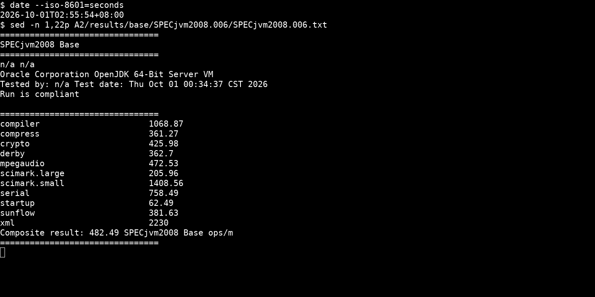
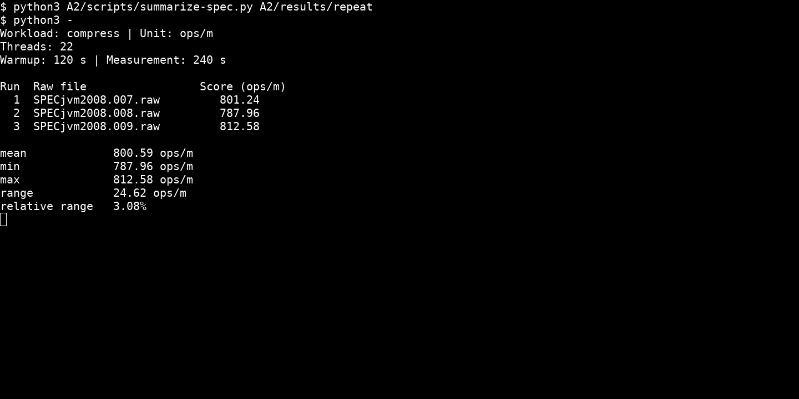
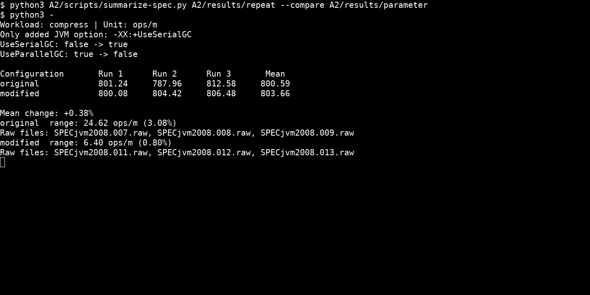

# 历史报告草稿：全部本机性能数据已作废

以下是替换测量前的报告草稿，保留用于溯源，不作正式交付。只调整了本地链接以指向归档位置。

# 上机作业 A2：SPECjvm2008 基准评测

学号：10245102410  
姓名：吴博闻

## 系统信息

| 系统信息 | 配置 |
|---|---|
| 操作系统 | Ubuntu 24.04.2 LTS，WSL2；Linux 6.18.33.2-microsoft-standard-WSL2，x86_64 |
| CPU | Intel Core Ultra 9 185H；WSL2 中可用 22 个逻辑处理器 |
| 内存 | WSL2 中显示 15.42 GiB；Swap 4 GiB |

## 1. SPECjvm2008 的用途与测试类别

SPEC（Standard Performance Evaluation Corporation）制定标准化性能基准。SPECjvm2008 衡量 Java 运行环境执行单个应用时的性能，也反映 CPU、内存和操作系统的影响；它对文件 I/O 的依赖较低，不包含跨机器网络 I/O。成绩以每分钟完成的操作数（ops/m）表示。[官网](https://www.spec.org/jvm2008/)、[FAQ](https://www.spec.org/jvm2008/docs/FAQ.html)

| Workload | 主要工作与特点 |
|---|---|
| compiler | 用套件自带的 javac 编译编译器自身和 Sunflow 源码，尽量减少文件 I/O 的影响 |
| compress | 对真实文件数据进行 LZW 压缩和解压，包含字符串查找和位操作 |
| crypto | 对称加解密、RSA 加解密及签名验证，使用 JRE 的加密实现 |
| derby | Java 数据库与 BigDecimal 运算，涉及数据库逻辑、锁和高精度计算 |
| mpegaudio | 用 JLayer 解码 MP3，浮点运算较多 |
| scimark | FFT、LU、SOR、稀疏矩阵和 Monte Carlo；大小数据集分别考察内存访问与计算表现 |
| serial | 对象序列化和反序列化，通过同机 socket 连接生产者与消费者 |
| startup | 新建 JVM 并完成一次工作负载，衡量 JVM 与应用的启动开销 |
| sunflow | 多线程全局光照渲染，每个渲染实例内部使用多个线程 |
| xml | XML 样式转换与模式校验，使用 JRE 提供的 XML API |

各项的具体定义见[官方 workload 说明](https://www.spec.org/jvm2008/docs/benchmarks/index.html)。

Base 各项采用统一的默认 JVM 配置，不允许手工调整 JVM 或规定运行时间；Peak 允许按测试项调优 JVM，并可延长运行时间。[User's Guide](https://www.spec.org/jvm2008/docs/UserGuide.html)、[Run and Reporting Rules](https://www.spec.org/jvm2008/docs/RunRules.html)

## 2. 安装、环境配置与完整 Base

SPECjvm2008 1.01（20090519）从[官方网站](https://www.spec.org/jvm2008/)下载，使用 JDK 8 安装到 `~/.local/opt/specjvm2008/`。正式测试使用[官方 OpenJDK 7u75 RI](https://jdk.java.net/java-se-ri/7)，安装在 `~/.local/opt/java-se-7u75-ri/`。机器原有 Java 21 在功能检查中出现模块访问错误，JDK 8 的 compiler 启动测试也遇到兼容问题，因此改用 Java 7；相关版本限制见 [FAQ Q4.8](https://www.spec.org/jvm2008/docs/FAQ.html#Q4.8)和 [Known Issues](https://www.spec.org/jvm2008/docs/KnownIssues.html)。



通过 `JAVA_HOME` 和 `PATH` 在实验进程中选择 JDK，`CLASSPATH` 与三个 JVM 选项环境变量均不设置。JDK 7 自带 FreeType 与系统 fontconfig 不兼容，运行时通过 `LD_PRELOAD` 使用系统 `libfreetype.so.6`，使报告图像正常生成。

```bash
export JAVA_HOME="$HOME/.local/opt/java-se-7u75-ri"
export PATH="$JAVA_HOME/bin:$PATH"
export LC_ALL=C.UTF-8
export LD_PRELOAD=/usr/lib/x86_64-linux-gnu/libfreetype.so.6
unset CLASSPATH JAVA_TOOL_OPTIONS _JAVA_OPTIONS JDK_JAVA_OPTIONS
cd "$HOME/.local/opt/specjvm2008"
java -jar SPECjvm2008.jar --base
```

Base 使用默认 JVM 配置，properties 未修改。正常吞吐项目预热 120 秒、测量 240 秒；套件按默认顺序执行 startup 和其余全部测试项。



这次 Base 的原生输出为 **482.49 SPECjvm2008 Base ops/m**。但运行期间系统时钟反复跳变，可能影响套件的操作数计算；下列性能数据尚不能作为可信结论，需要在时钟稳定后重新测量。



完整结果保存在 [results/base/SPECjvm2008.006/](invalidated-results/base/SPECjvm2008.006/)，包括 [HTML 报告](invalidated-results/base/SPECjvm2008.006/SPECjvm2008.006.html)、[TXT 报告](invalidated-results/base/SPECjvm2008.006/SPECjvm2008.006.txt)、[raw 数据](invalidated-results/base/SPECjvm2008.006/SPECjvm2008.006.raw)、summary、sub 和全部报告图片。

## 3. 总体结果与测试项分析

| Workload | Score | Unit | 特点 |
|---|---:|---|---|
| compress | 361.27 | ops/m | LZW 压缩和解压，处理真实文件数据 |
| derby | 362.70 | ops/m | Java 数据库逻辑、锁与 BigDecimal 计算 |
| crypto.aes | 184.65 | ops/m | 使用 JRE 实现的 AES、DES 加解密 |

compress 主要进行字符串匹配和变长编码，涉及整数运算、位操作与数组访问。[compress 说明](https://www.spec.org/jvm2008/docs/benchmarks/compress.html)

derby 的分数与 compress 接近，但每次操作还包含数据库逻辑、锁和高精度十进制计算，两者完成的工作内容不同。[derby 说明](https://www.spec.org/jvm2008/docs/benchmarks/derby.html)

crypto.aes 的操作率低于另外两项，它包含不同输入大小、加密模式下的 AES 和 DES 运算，表现也受 JRE 加密实现影响。截图中的 crypto 是加密组多个子项的几何平均，表中列出的是 crypto.aes 单项。[crypto 说明](https://www.spec.org/jvm2008/docs/benchmarks/crypto.html)

各项操作的定义不同，分数比例不能直接解释为同一任务的加速比。

## 4. 与官方结果比较

选用 Sugon I620-G20 的记录 `jvm2008-20150120-00018`。该记录在 2015 年 2 月 23 日首次发布，测试日期为 2014 年 12 月 25 日，Base 成绩为 **853.15 ops/m**。[Summary Report](https://www.spec.org/jvm2008/results/res2015q1/jvm2008-20150120-00018.html)、[Base Report](https://www.spec.org/jvm2008/results/res2015q1/jvm2008-20150120-00018.base/SPECjvm2008.base.html)


| 配置 | 官方记录 | 本机 |
|---|---|---|
| 操作系统 | Red Hat Enterprise Linux 6.5，64 位 | Ubuntu 24.04.2 LTS / WSL2 |
| CPU | 2 × Xeon E5-2660 v3，20 核、40 逻辑处理器，2.60 GHz | Core Ultra 9 185H，WSL2 中 22 逻辑处理器 |
| 内存 | 256 GB，16 × 16 GB DDR4-2133 | WSL2 中 15.42 GiB |
| JDK/JVM | Red Hat OpenJDK 1.7.0_45，64-Bit Server VM 24.45-b08 | OpenJDK 1.7.0_75 RI，64-Bit Server VM 24.75-b04 |
| 测试日期 | 2014-12-25 | 2026-10-01 |
| Base 总体结果 | 853.15 ops/m | 482.49 ops/m |

本机总分低于官方记录。官方机器有更多逻辑处理器和更大的内存，处理器架构、JVM 版本、操作系统及 WSL2 与宿主共享资源等因素也可能共同影响结果，不能只归因于某一项配置。

## 5. 单项三次独立运行

选择 compress，每次重新启动 JVM 单独运行，使用相同的 JDK、环境变量和默认 22 个基准线程，预热 120 秒、测量 240 秒。完整 Base 中的 compress 分项不计入这组三次统计。

```bash
java -jar SPECjvm2008.jar compress
```



| 次数（完整原生结果） | Score（ops/m） |
|---|---:|
| [1](invalidated-results/repeat/SPECjvm2008.007/) | 801.24 |
| [2](invalidated-results/repeat/SPECjvm2008.008/) | 787.96 |
| [3](invalidated-results/repeat/SPECjvm2008.009/) | 812.58 |
| 平均 | 800.59 |

结果范围为 787.96–812.58 ops/m，极差 24.62 ops/m，为平均值的 3.08%。JIT 编译、垃圾回收、操作系统调度和缓存状态都可能影响吞吐，WSL2 还与宿主共享资源，因此相同参数也不保证每次成绩相同。

## 6. 运行体会与问题处理

全套短测先暴露了兼容问题。JDK 8 的 startup.compiler.sunflow 因套件未读取子进程的大量 stderr 而阻塞，改用 Java 7 后启动测试正常；随后遇到的报告字体库冲突，又通过预加载系统 FreeType 解决。只看退出码容易漏掉后一个问题，因为那次 Java 进程仍返回了 0。

完整 Base 和每次新建 JVM 的单项结果差别较大，因此比较时要固定运行方式。时钟问题也说明，计算结果正确并不代表性能计时可靠，重复运行前还要确认测量条件稳定。

## 7. 修改一个 JVM 参数

只增加 **`-XX:+UseSerialGC`**，将默认的 Parallel GC 改为 Serial GC。三次测量进程的命令均包含该参数；同一 JDK 下另启 JVM 的 `PrintFlagsFinal` 检查显示 `UseSerialGC` 从 false 变为 true，初始堆和最大堆默认值相同。compress 会创建辅助对象和表数组，因此选择收集器作为对比参数。[Java 7 GC Ergonomics](https://docs.oracle.com/javase/7/docs/technotes/guides/vm/gc-ergonomics.html)

```bash
java -XX:+UseSerialGC -jar SPECjvm2008.jar compress
```

原配置复用第 5 题的三次结果；修改后三次独立运行保持相同的 SPEC 参数、22 个基准线程和 120/240 秒时长。完整结果分别保存在 [results/repeat/](invalidated-results/repeat/) 和 [results/parameter/](invalidated-results/parameter/)。



| 配置 | Run 1 | Run 2 | Run 3 | Mean |
|---|---:|---:|---:|---:|
| 原配置（Parallel GC） | 801.24 | 787.96 | 812.58 | 800.59 |
| 修改后（Serial GC） | 800.08 | 804.42 | 806.48 | 803.66 |

表中单位均为 ops/m。原始分数的平均值变化按 `(修改后均值 − 原均值) / 原均值 × 100%` 计算，为 **+0.38%**，小于原配置的相对极差 **3.08%** 和修改后的 **0.80%**，不能认定有明显提升。Serial GC 改变回收时的并行程度和线程协调开销，但这两组三次结果不足以确定其对 compress 吞吐的具体影响。

未启用自动参数采集 `-pja`，原生报告的 JVM 命令字段为 `n/a`，标题仍沿用 Base。这里比较的是两种配置下的单项 compress，不能作为完整 Base 或 Peak 总分。
