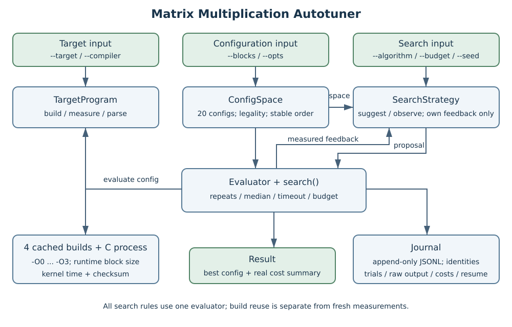
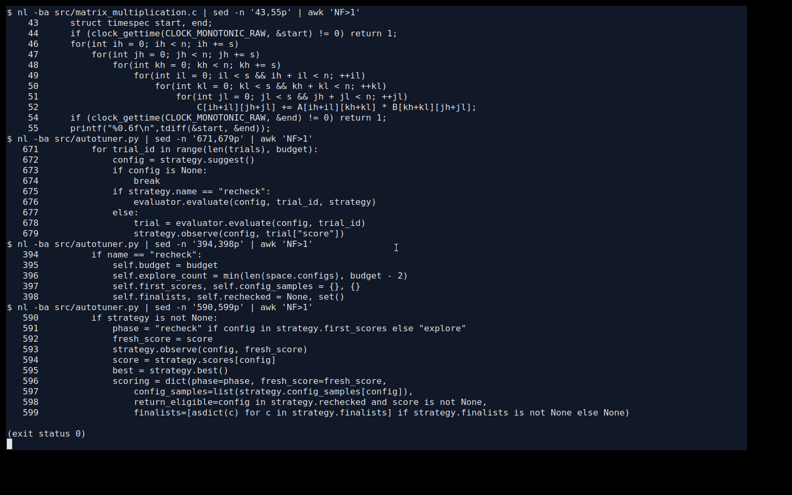
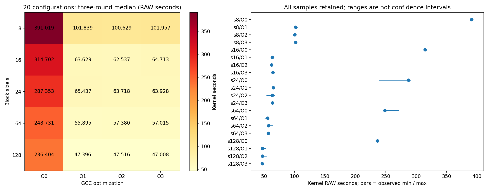
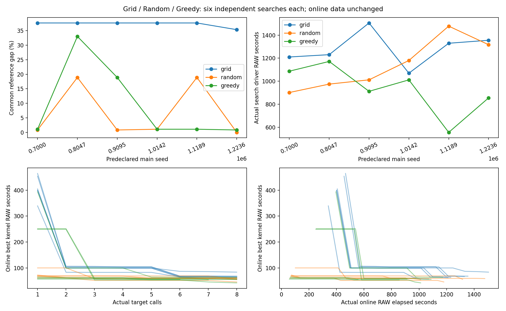
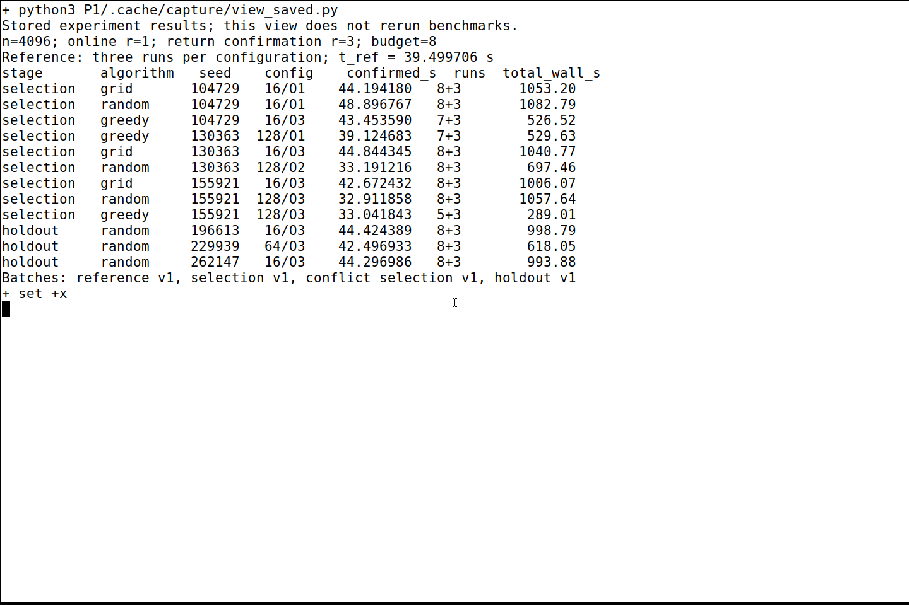
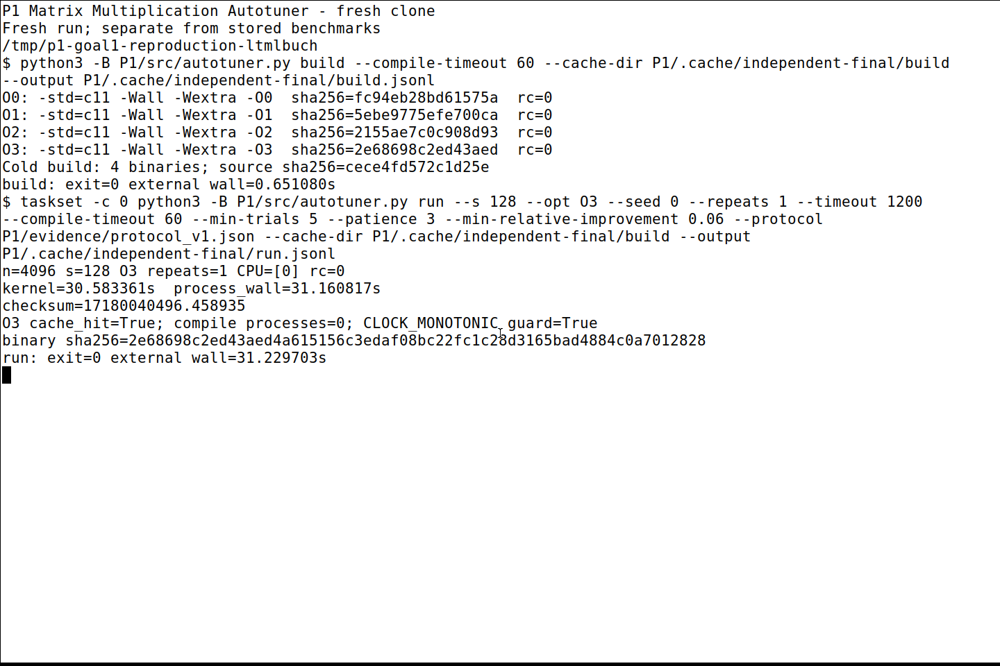

# 实践项目 P1：Matrix Multiplication Autotuner

学号：10245102410

姓名：吴博闻

实验环境：Ubuntu 24.04.2 LTS / WSL2；CPU 为 Intel Core Ultra 9 185H；WSL2 显示总内存约 15.42 GiB；编译器为 GCC 13.3.0。目标程序串行运行，亲和性设为 WSL2 逻辑 CPU 0。

## 1. Autotuner 的三个接口



### （1）输入目标程序

[TargetProgram](src/autotuner.py) 接收 C 源码和编译器，负责构建、运行及解析耗时。四个优化级别分别构建，分块大小作为运行参数；缓存核对源码、编译器、完整选项及二进制，每次测量仍启动新进程。

### （2）输入配置参数值组合

`ConfigSpace` 接收分块和优化级别的候选列表，检查合法值并枚举组合。配置空间与搜索顺序分开，完整空间固定为 20 个组合。

### （3）输入搜索算法

`SearchStrategy.suggest()` 提出配置，`observe(config, score)` 接收刚取得的测量反馈。`Evaluator` 统一处理重复、超时和失败，`search()` 控制预算并返回已测配置的最好结果；失败、NaN、零或缺失耗时不会成为最优。

三种基础算法的反馈路径如下：

```python
config = strategy.suggest()
trial = evaluator.evaluate(config, trial_id)
strategy.observe(config, trial["score"])
```

日志记录每次真实调用，恢复时只继续未开始的测量，已完成及失败的调用仍占预算。



三类接口使算法共用同一目标和评估过程，也便于增加搜索规则；Python 调优器只依赖标准库。限制是目标需要约定输出格式，串行调优成本较高，测量噪声及局部搜索都可能影响返回配置。

## 2. 输入的 Matrix Multiplication 程序

[原始附件](src/matrix_multiplication.original.c) 按字节保留。[运行目标](src/matrix_multiplication.c) 保持 n=4096、`double`、原初始化及六层乘法循环。s=24 时末块长度为 16，每层的边界判断保证尾块参与计算。

适配增加参数检查、计时后的 checksum，并在原计时边界使用 `CLOCK_MONOTONIC`；初始化和 checksum 均在乘法计时之外。统一计时域可以避免错误地比较两种单位相同但速率不同的时间，仍不能消除 WSL2 中的时段变化。后续诊断发现同一程序的时间域关系超过预定变化限，因此停止了新一批性能比较。下文保留先前完成的样本，不能据此确认 5% 内的细小排序；也没有将旧秒数乘比例校正。

n=128、129 的同源版本与独立 `long double` 点积逐元素比较，五个分块、四个优化级别和六组输入共 240 个用例通过；n=129 的五个分块通过 ASan/UBSan。n=4096 的 O0/s=24 与 O3/s=128 各抽查 24 个预定位置，最大绝对误差为 2.937539×10⁻¹²。大矩阵抽查不等于全量逐元素验证。

## 3. 输入的配置参数值组合

### （1）循环分块大小

`s ∈ {8, 16, 24, 64, 128}`，通过目标程序的命令行参数传入。

### （2）编译优化级别

`O ∈ {O0, O1, O2, O3}`。四级公共选项为 `-std=c11 -Wall -Wextra`，仅改变 `-O0` 至 `-O3`，共 5×4=20 个配置。

## 4. 三种参数值搜索算法

### （1）Grid Search 与完整配置结果

Grid 按 s 外层、O 内层完整枚举 20 个组合。下表来自先前的三个完整随机轮次，每轮每配置测一次；随机次序用于减轻固定顺序的时段影响，完整覆盖不变。

| s | O0（秒） | O1（秒） | O2（秒） | O3（秒） |
| ---: | ---: | ---: | ---: | ---: |
| 8 | 300.623230 | 77.373161 | 78.313446 | 78.263649 |
| 16 | 217.292618 | 44.326172 | 43.614208 | 44.371098 |
| 24 | 210.435379 | 46.188328 | 43.737030 | 44.067669 |
| 64 | 179.600632 | 41.472359 | 41.239479 | 41.112492 |
| 128 | 178.396179 | 41.177814 | 39.499706 | 42.501537 |



数值为 n=4096 的内核时间中位数，每配置三个有效样本。完整样本、最小值、最大值和 MAD 见[配置统计表](results/summary/grid_summary.csv)。最小中位数对应 s=128/O2，中位数 39.499706 秒；其三个样本为 40.385387、39.499706、34.484921 秒，MAD 为 0.885681 秒。

O0 明显较慢，s=8 时约 300.62 秒，O1—O3 降至约 77—78 秒。O0 内层反复读取栈上的索引并计算地址，O1 使用寄存器和指针递增，与控制开销减少的趋势相符。s 从 8 增大到 16 后，O1—O3 约为 44 秒；继续增大并非单调加速。大块减少块边界检查，也改变 B、C 的访问范围，仅凭时间不能断定缓存命中率。

这些构建的乘法内核使用标量乘加，O2 与 O3 的计时区间汇编相同，不能把 O3 解释成使用 SIMD 或必然更快。s=128 的 O1、O2、O3 第三轮都明显变快，其中 O3 样本范围为 33.005756—46.760860 秒；这些小差异无法与时段影响可靠分开。

### （2）Random Search、Greedy 与比较

Random 按 seed 打乱全部配置，无放回访问。Greedy 从 seed 决定的单一起点出发，检查一个参数沿候选列表移动一格的邻居，只接受严格更快的配置；无改善时停止，预算耗尽时返回已测过的最好配置。起点和所有试探都占预算。

先前三种算法各完成三个独立搜索，预算 B=8、每配置一次在线测量，返回后另测三个新样本。选择差距统一为 `g_ref(c)=100×(T_ref(c)/min T_ref−1)`，`T_ref(c)` 取上面的同一参照表。相同配置对应同一差距；另测的确认秒数单独保存，不用于判定两个相同配置的选择优劣。

| 算法 | seed / 重复标识 | 返回配置 | g_ref（%） | 调用数（搜索+确认） | 完整耗时（秒） |
| --- | ---: | --- | ---: | ---: | ---: |
| Grid | 104729 | s16/O1 | 12.22 | 8+3 | 1053.20 |
| Grid | 130363 | s16/O3 | 12.33 | 8+3 | 1040.77 |
| Grid | 155921 | s16/O3 | 12.33 | 8+3 | 1006.07 |
| Random | 104729 | s16/O1 | 12.22 | 8+3 | 1082.79 |
| Random | 130363 | s128/O2 | 0.00 | 8+3 | 697.46 |
| Random | 155921 | s128/O3 | 7.60 | 8+3 | 1057.64 |
| Greedy | 104729 | s16/O3 | 12.33 | 7+3 | 526.52 |
| Greedy | 130363 | s128/O1 | 4.25 | 7+3 | 529.63 |
| Greedy | 155921 | s128/O3 | 7.60 | 5+3 | 289.01 |

[配置选择与分账表](results/identity_quality_v2/search_choices.csv)保留原在线时间、独立确认及搜索成本。表中完整耗时为进程外的 `MONOTONIC` 时间，包含搜索、构建检查及返回确认；四级构建已共同准备。差距反映这张有噪声参照表中的位置，不是已证明的近优分类。



曲线记录每步当时观测的最好时间，不填入参照或后续确认。左侧横轴为评估数，右侧为搜索内部反馈窗口，未包含返回确认。

八次预算的固定 Grid 次序只访问 s=8、16，不能据此前缀断言所有枚举顺序都差；完整遍历的优势是覆盖确定，代价是需要测完全部配置。Random 实现简单，但有限预算可能漏掉好配置。Greedy 的三个起点为 s16/O2、s128/O3、s64/O3，这几次较快结束，搜索加确认的耗时中位数为 526.52 秒，Random 为 1057.64 秒；起点覆盖不足，不能推广为普遍优势。

另外三个未参与先前选择的 Random seed 为 196613、229939、262147，返回 s16/O3、s64/O3、s16/O3；同一参照下差距为 12.33%、4.08%、12.33%，完整耗时为 998.79、618.05、993.88 秒。s64/O3 的独立确认耗时为 42.496933 秒，属于另一个时段的观测，不能把它与参照的差直接当作随机搜索造成的退化。

先前单独尝试过分层访问和有限停止，都没有获得可确认收益，因此基础算法继续保留。新实现的有限候选复核用同一 Random 前缀探索六项，再将两次调用用于候选复测，保持总预算八次；它减少探索范围，可能减小首测噪声，也可能错过好配置。重复分配借鉴[重复测量研究（2021）](https://arxiv.org/abs/2103.08716)，但没有继承论文的置信区间保证；调优成本分别记录的依据见[比较方法研究（2024）](https://doi.org/10.1016/j.future.2024.05.021)。因时钟检查未满足进入新比较的条件，这项复核策略尚未取得正式性能数据，未替换基础算法。计划的新六组比较、独立新种子确认及起点面板也尚未执行。



### 运行方式

从仓库根目录执行：

```bash
python3 P1/src/autotuner.py list
taskset -c 0 python3 P1/src/autotuner.py search --algorithm random \
  --budget 8 --seed 104729 --repeats 1 --timeout 1200 \
  --output P1/.cache/demo-search.jsonl
```

`--target` 输入源码，`--blocks` 与 `--opts` 输入候选值，`--algorithm` 选择规则。四级构建、单配置运行、测试和重生成入口见 [README](README.md)。性能实验需要稳定且可比的测量条件。


